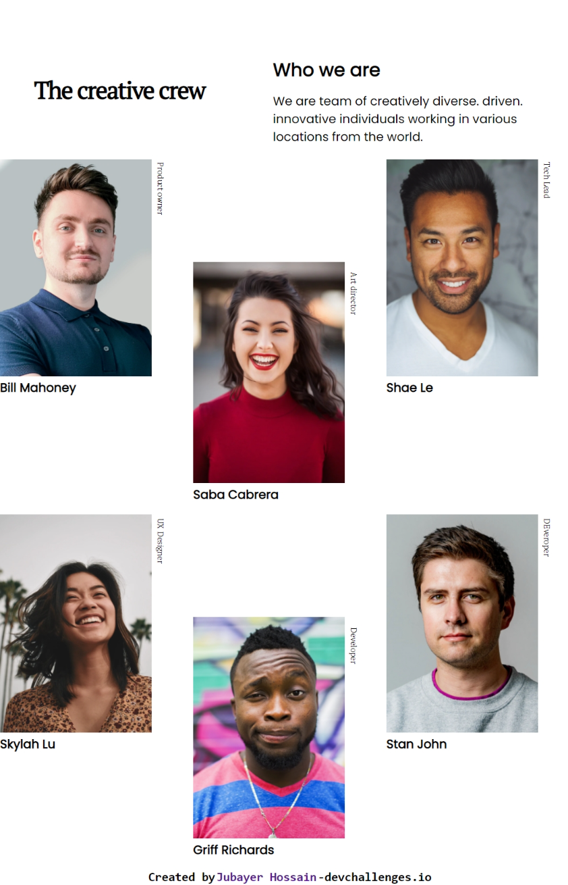
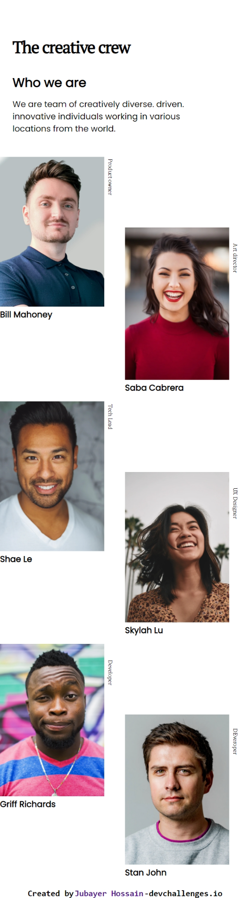

<h1 align="center">{My team page}</h1>

   Solution for a challenge from  <a href="http://devchallenges.io" target="_blank">Devchallenges.io</a>.

  <h3>
    <a href="https://{https://myteampages.netlify.app/}">
      Demo
    </a>
     | 
    <a href="https://github.com/coder71-bd/my-team-page">
      Solution
    </a>
     | 
    <a href="https://devchallenges.io/challenges/hhmesazsqgKXrTkYkt0U">
      Challenge
    </a>
  </h3>

<!-- TABLE OF CONTENTS -->

## Table of Contents

- [Overview](#overview)
  - [Built With](#built-with)
- [Features](#features)
- [Contact](#contact)

## Overview

### Built With

- Semantic HTML5 markup
- CSS custom properties
- CSS grid
- CSS Media Queries
- Mobile-first workflow

## Features

This application/site was created as a submission to a [DevChallenges](https://devchallenges.io/challenges) challenge. The [challenge](https://devchallenges.io/challenges/hhmesazsqgKXrTkYkt0U) was to build a responsive page by following their design.

## Contact
- GitHub [@coder71-bd](https://github.com/coder71-bd)
